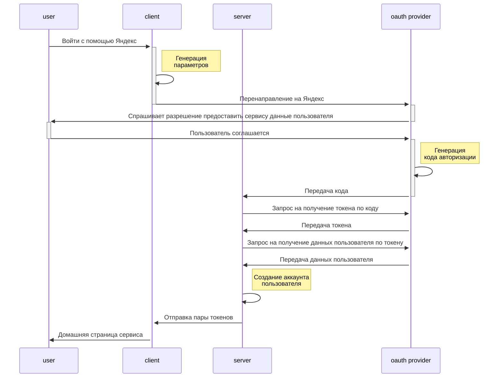
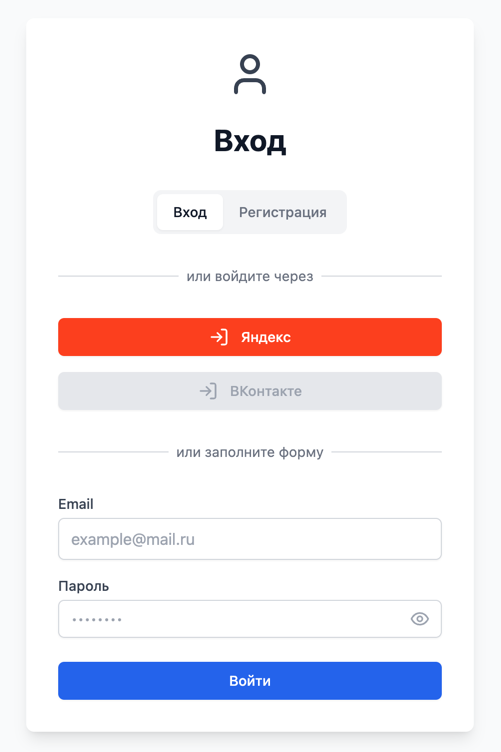

<p align="center">
  <a href="http://nestjs.com/" target="blank"></a>
</p>

<p align="center">
    
    
    
</p>

## Description

Project stack: Nest, Postgres, TypeORM, Docker, Docker Compose, TypeScript, Jest, Swagger

## Distribute

In progress

## Documentation

### Диаграмма работы авторизации через oauth



### Сервис предоставляет следующие API:

#### Регистрация и подтверждение email
- `POST /auth/registration` - Регистрация нового пользователя

- `POST /auth/registration-confirmation` - Подтверждение email после регистрации

- `POST /auth/resend-confirmation-code` - Повторная отправка кода подтверждения

#### Аутентификация
- `POST /auth/login` - Вход в систему

- `POST /auth/refresh-token` - Обновление токенов

- `GET /auth/me` - Получение информации о текущем пользователе

- `POST /auth/logout` - Выход из системы

#### Восстановление пароля
- `POST /auth/password-recovery` - Запрос на восстановление пароля

- `POST /auth/confirm-password-recovery` - Подтверждение восстановления пароля

- `POST /auth/update-password` - Установка нового пароля

#### OAuth Аутентификация
- `POST /auth/oauth/:type` - Аутентификация через внешние сервисы
  - Параметр пути: type (google, github)
  - Тело запроса: code (код авторизации от провайдера)
  - Ответ: accessToken
  - Cookie: refreshToken

#### Управление устройствами
- `GET /device` - Получение списка устройств пользователя

- `DELETE /device` - Удаление всех устройств кроме текущего

- `DELETE /device/:id` - Удаление конкретного устройства

Все эндпоинты имеют ограничение: не более 5 запросов с одного IP-адреса в течение 10 секунд.

### Идеи для нового функционала:
- Интеграция с сервисами TOTP (Google Authenticator, Authy)
- управление ролевой моделью
- Двухфакторная аутентификация (2FA)
- регистрация сторонних сервисов в сервисе авторизации???
- Поддержка SSO (Single Sign-On)
- решить проблему: как быть, если пользователь зарелся через oauth и хочет залогинить через логин и пароль
`
Решить эту проблему можно, например, с помощью синхронизации почтовых адресов. Если при OAuth-аутентификации в вашей базе обнаруживается совпадение по адресу, пользователю можно отправить сообщение типа «указанная почта уже использовалась при входе другим способом, проверьте свой способ аутентификации». Это потребует дополнительных ресурсов для реализации.

Существует альтернативное решение — «магические ссылки», которые отправляются на почту, указанную пользователем при входе. Перейдя по ссылке, он начинает авторизованную сессию. Такой метод аутентификации доказал свою надёжность и уже стал стандартом в web3-сервисах.
`

### Еще ряд идей:
- Интеграция с новыми протоколами: Включите поддержку новых протоколов, таких как WebAuthn или FIDO2, которые обеспечивают более безопасную и удобную авторизацию.
- Использование машинного обучения: Используйте алгоритмы машинного обучения для улучшения безопасности и точности авторизации, а также для предотвращения мошенничества и других типов атак.
- Поддержка различных типов идентификации: Добавьте поддержку различных типов идентификации, таких как биометрическая идентификация (лицо или отпечатки пальцев), голосовая идентификация или другие методы идентификации.
- Интеграция с блокчейнами: Включите поддержку интеграции с блокчейн-технологиями, которые обеспечивают более безопасную и прозрачную авторизацию.
- Интеграция с другими сервисами: Включите поддержку интеграции с другими сервисами и приложениями, чтобы обеспечить единую систему авторизации.
- Аналитика и отчетность: Предоставьте пользователям возможность получать анализ и отчеты о их авторизации и безопасности.

## Developers

 - [Artyom Golubev](https://github.com/Artyom099)

## License

This project is distributed under the [MIT license]()

### Создание миграции
```
typeorm migration:create ./src/libs/db/migration/MIGRATION_NAME
```

## Interface


